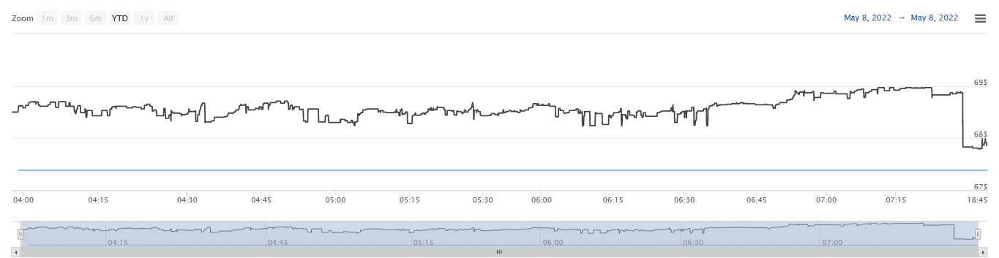
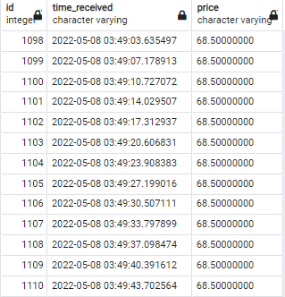
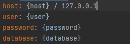

<h2 align="center">Stock chart with FastApi and Highcharts JS</h2>

  

<h2>Requirements</h2>
<ul>
    <li>PostgreSQL 14.2</li>
    <li>Python 3.10.4</li>
    <ul>
        <li>libs : 'requirements.txt'</li>
    </ul>
</ul>

  

<h2>Database structure</h2>
<h3>Columns</h3>
<ul>
    <li>id - ()int. type - identity</li>
    <li>time_received - varchar.</li>
    <li>price - numeric</li>
</ul>

  

<h2>Config structure</h2>

  

<h2>Usage</h2>
<h4>as long as uvicorn have troubles running asynchronously,
    we have to run "main.py" and "headapi.py" separately</h4>
    <ul>
    <li> 0. create "host.yml"</li>
    <ul>
    <li> example above </li>
    </ul>
     
    <li> 1. install libs </li>
    <ul>
    <li> $pip install -r requirements.txt</li>
    </ul>
     
    <li> 2. run "db_create.py"</li>
    <ul>
    <li> $python3 db_create.py </li>
    </ul>
     
    <li> 3. run "main.py"</li>
    <ul>
    <li> $python3 main.py </li>
    </ul>
     
    <li> 4.run "headapi.py"</li>
    <ul>
    <li> $python3 headapi.py </li>
        <ul>
        <li>127.0.0.1:8220 by default</li>
        </ul>
    </ul>
